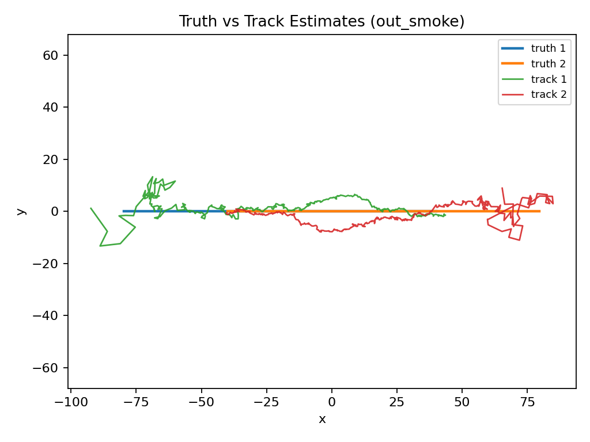
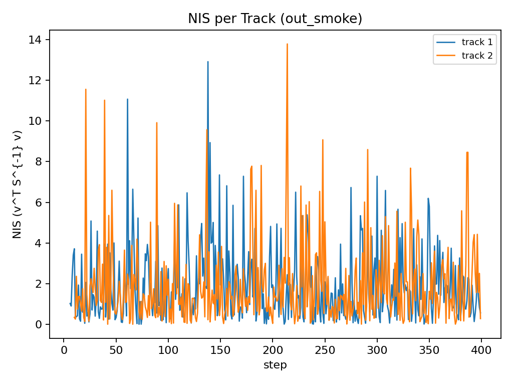

# Radar Target Tracking Engine


Deterministic 2D multi-target radar tracking engine in C++17 implementing:

- Constant-Velocity Kalman Filter
- Mahalanobis gating
- Multi-target track lifecycle management
- Greedy & Hungarian data association
- Deterministic simulation with golden-hash verification

This project focuses exclusively on state estimation and multi-target tracking logic.  
Visualization is provided separately via Python plotting scripts.

## Quick Start

Minimal build and run example:

```bash
cmake -S . -B build -G Ninja
cmake --build build -j
./build/radar_tracker.exe --scenario cross --hungarian 1
```

---

## Example Output (Cross Scenario, Hungarian)





The figures above show:

- Ground truth vs track estimates (no ID swaps in cross scenario)
- NIS statistical behavior for consistency validation

---

## System Overview

This repository implements a fully deterministic end-to-end radar tracking pipeline.

## Motion & Measurement Model

- 2D constant-velocity (CV) motion model
- State vector: `[x, y, vx, vy]^T`
- Discrete white-noise acceleration process model
- Gaussian radar measurements (position only)
- Configurable detection probability
- Optional uniform clutter injection

---

## Estimation Core

- Kalman Filter (predict-update)
- Innovation computation
- Innovation covariance (S)
- NIS (Normalized Innovation Squared)
- Mahalanobis-distance gating

---

## Multi-Target Tracking

- Track IDs
- Missed detection handling
- Track initiation from unassigned measurements
- Track termination via miss threshold
- M-of-N confirmation logic
- Greedy nearest-neighbor association
- Hungarian global assignment (optional)

---

## Determinism & Reproducibility

- Fixed random seed
- FNV-1a 64-bit hash of simulation outputs
- Smoke test for regression detection

Golden hash (cross scenario, seed=123):

```text
FNV1A64=9c3d2602b240fd45
```

## Repository Structure

```text
src/
  main.cpp
  sim.cpp / sim.h
  tracker.cpp / tracker.h
  kalman.cpp / kalman.h
  hungarian.cpp / hungarian.h
  math_types.h
  rng.h
  csv.h
  fnv1a.h

scripts/
  smoke.sh

tools/
  plot_tracks.py
  plot_nis.py
  requirements.txt

plots/
  tracks_out_smoke.png
  nis_out_smoke.png
```

## Build (Windows – MSYS2 UCRT64 example)

### Install Dependencies

```bash
pacman -S --needed \
  mingw-w64-ucrt-x86_64-toolchain \
  mingw-w64-ucrt-x86_64-cmake \
  mingw-w64-ucrt-x86_64-ninja \
  mingw-w64-ucrt-x86_64-eigen3
```

### Configure and Build

```bash
cd /c/Users/AliEray/Desktop/Staj-Proje/radar-target-tracking-engine
cmake -S . -B build -G Ninja
cmake --build build -j
```

## Running the Simulation

Example run (cross scenario, Hungarian enabled):

```bash
./build/radar_tracker.exe \
  --steps 400 \
  --seed 123 \
  --scenario cross \
  --hungarian 1 \
  --clutter 0 \
  --p_detect 1.0 \
  --sigma_z 15 \
  --gate_maha2 50 \
  --out out_smoke
```

Expected output:

```text
FNV1A64=9c3d2602b240fd45
Wrote logs to: out_smoke
Files: truth.csv, meas.csv, tracks.csv, residuals.csv

=== RUN SUMMARY ===
scenario=cross
hungarian=1
steps=400 dt=0.05 targets=2 sigma_z=15 p_detect=1 clutter=0 clutter_n=6 clutter_A=300
confirm_M=3 confirm_N=5
measurements_total=800 clutter_total=0
tracks_created_estimate=2 tracks_alive_final=2 confirmed_final=2
assoc_updates=784 maha2_avg=1.88318
steps_per_sec ≈ 1.3e4
```

## Output Files

Each run generates the following files:

- `truth.csv` — Ground-truth target states
- `meas.csv` — Noisy radar measurements (including clutter if enabled)
- `tracks.csv` — Estimated track states
- `residuals.csv` — Innovation and covariance statistics

## Association Comparison

Built-in demo:

```bash
./build/radar_tracker.exe --assoc_demo 1
```

Example output:

```text
=== ASSOC DEMO (Greedy vs Hungarian) ===
cost matrix:
  row 0: 1, 2
  row 1: 2, 100

greedy assignment: 0->0, 1->1  total_cost=101
hungarian assignment: 0->1, 1->0  total_cost=4
```

Demonstrates why global assignment can outperform greedy matching.

## Visualization (Python Tools)

Install plotting dependencies:

```bash
python -m pip install -r tools/requirements.txt
```

Generate plots:

```bash
python tools/plot_tracks.py --in out_smoke
python tools/plot_nis.py --in out_smoke
```

Outputs:

- plots/tracks_out_smoke.png
- plots/nis_out_smoke.png

These plots validate:

- Stable estimation
- No ID swaps (cross scenario)
- Proper statistical consistency

## Deterministic Smoke Test

```bash
chmod +x scripts/smoke.sh
./scripts/smoke.sh
```

Expected:

```text
[SMOKE] expected=9c3d2602b240fd45
[SMOKE] got     =9c3d2602b240fd45
[SMOKE] PASS
```

If the hash changes, simulation behavior or output formatting changed.

---

## CLI Parameters

| Parameter      | Description                          |
|---------------|--------------------------------------|
| --steps       | Number of simulation steps           |
| --dt          | Timestep                             |
| --targets     | Number of targets                    |
| --sigma_z     | Measurement noise std                |
| --sigma_a     | Process noise std                    |
| --p_detect    | Detection probability                |
| --clutter     | Enable clutter (0/1)                 |
| --clutter_n   | Clutter per step                     |
| --clutter_A   | Clutter area half-size               |
| --gate_maha2  | Mahalanobis gate threshold           |
| --confirm_M   | Confirmation hits                    |
| --confirm_N   | Confirmation window                  |
| --hungarian   | Use global assignment                |
| --scenario    | Scenario type (default / cross)      |
| --seed        | Random seed                          |
| --out         | Output directory                     |

## Performance Characteristics

Example benchmark (cross scenario, no clutter):

```text
steps=400
targets=2
sigma_z=15
hungarian=1
steps_per_sec ≈ 1.3e4
```

Performance is deterministic and reproducible under identical seeds and parameters.

## Engineering Highlights

- Fully deterministic simulation core
- Regression-detecting golden hash
- Multi-target lifecycle management
- Configurable clutter model
- Greedy vs Hungarian comparison
- Statistical validation via NIS
- Clean CMake-based build
- Eigen-based linear algebra

## Technologies

- C++17
- Eigen (linear algebra)
- CMake
- Ninja
- Python (NumPy, Matplotlib)

## License

MIT

## Author

Ali Eray Kalaycı  
Computer Engineering  
Focus: Real-Time Systems, Tracking & Estimation, Autonomous Systems